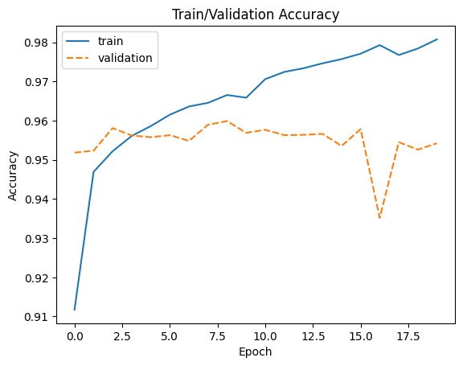
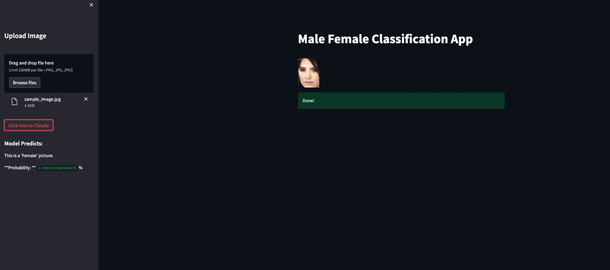

# Classify Male/Female image

## Installations
 - NumPy
 - Pandas
 - Seaborn
 - Matplotlib
 - torch
 - torchvision
 - Pillow
 - Streamlit
 - Flask
 - FlaskRestful 
 

## Project Motivation
For this project I was interested in classifying male/female image. Dataset from [kaggle](https://www.kaggle.com/datasets/cashutosh/gender-classification-dataset)

The project involved:
  - Loading and preprocessing dataset (download from kaggle)
  - Training using pretrained model from torchvision. The model used is Alexnet.
  - Customizing model for 2 classes (male and female)
  - Flask API for model inference
  - Streamlit application for UI

## File Descriptions
- This is one jupyter notebook file and one html file containing details step by step to build model

## Result
- The model has trained by 20 epochs.
- 
- ]
- To run the app:
  - 1st step: `python app.py` for starting flask API for model inference
  - 2st step: `streamlit run streamlit_app.py` for starting streamlit application.

When the app runs successfully, it can be accessed by this link
`http://localhost:8501`
- 

