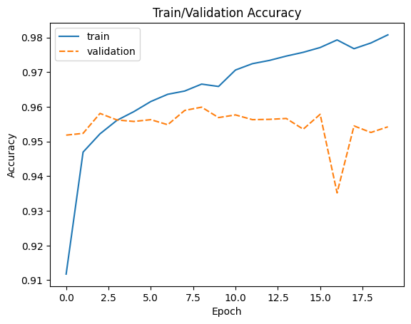
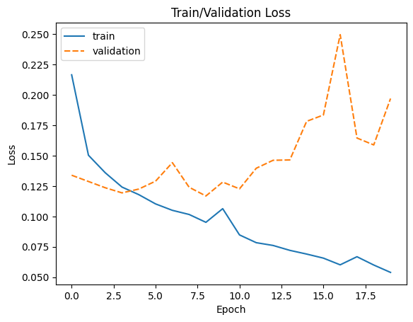

# Overview
In this project, I will build classification model on male/female dataset from [Kaggle dataset](https://www.kaggle.com/datasets/cashutosh/gender-classification-dataset). This project aims to classify gender based on input image. There are two classes: male and female. 

## Problem domain
Computer vision, for more specifically, face iamges of male/female
# Description of Input Data
About dataset

The data set is of cropped images of male and female . It is split into training and validation directory. Training contains ~23,000 images of each class and validation directory contains ~5,500 images of each class.

Images do not have same shape, then resize or normalized should be included.

#  Strategy for solving the problem
By using pretrained model from library `torchvision` to fine-tune in our dataset. There are many models avalable there. In this project, `Alexnet` will be used. Input of this model is (3, 64, 64): 3 channel image, output shape is 2, male/female classes.

# Discussion of the expected solution
The output of this is to build succesfully a model to classify gender based on images.

# Metrics with justification
The metric used in this problem is accuracy.
$${\displaystyle {\text{Accuracy}}={\frac {TP+TN}{TP+TN+FP+FN}}}$$

This is a classification problem, accuracy, f1-score can be used for evaluating model. Since propotion of male/female is nearly 50%, then using accuracy for this problem is suitable.
# Data processing
Since, the input shape of images are not the same, then resize is used. Here I am using 
```
train_transform = v_transforms.Compose(
    [v_transforms.Resize((64, 64)),
     v_transforms.ToTensor(),
    ])
```
This makes sure the input before putting to model having the shape (3, 64, 64)
# Modeling
In this project, [Alexnet](https://pytorch.org/vision/main/models/generated/torchvision.models.alexnet.html) is used. Below is the detail of model.
```
----------------------------------------------------------------
        Layer (type)               Output Shape         Param #
================================================================
            Conv2d-1           [-1, 64, 15, 15]          23,296
              ReLU-2           [-1, 64, 15, 15]               0
         MaxPool2d-3             [-1, 64, 7, 7]               0
            Conv2d-4            [-1, 192, 7, 7]         307,392
              ReLU-5            [-1, 192, 7, 7]               0
         MaxPool2d-6            [-1, 192, 3, 3]               0
            Conv2d-7            [-1, 384, 3, 3]         663,936
              ReLU-8            [-1, 384, 3, 3]               0
            Conv2d-9            [-1, 256, 3, 3]         884,992
             ReLU-10            [-1, 256, 3, 3]               0
           Conv2d-11            [-1, 256, 3, 3]         590,080
             ReLU-12            [-1, 256, 3, 3]               0
        MaxPool2d-13            [-1, 256, 1, 1]               0
AdaptiveAvgPool2d-14            [-1, 256, 6, 6]               0
          Dropout-15                 [-1, 9216]               0
           Linear-16                 [-1, 4096]      37,752,832
             ReLU-17                 [-1, 4096]               0
          Dropout-18                 [-1, 4096]               0
           Linear-19                 [-1, 4096]      16,781,312
             ReLU-20                 [-1, 4096]               0
           Linear-21                 [-1, 1000]       4,097,000
================================================================
Total params: 61,100,840
Trainable params: 61,100,840
Non-trainable params: 0
----------------------------------------------------------------
Input size (MB): 0.05
Forward/backward pass size (MB): 0.83
Params size (MB): 233.08
Estimated Total Size (MB): 233.96
----------------------------------------------------------------
```

# Hyperparameter Tuning
- For optimizer, Adam is used.
- For loss function, CrossEntropy is used.
- Number of epoch: 20
```
optimizer = torch.optim.Adam(model.parameters())
criterion = torch.nn.CrossEntropyLoss()
```
## Result
- The model has trained by 20 epochs.
- 
- ]

Based on the accuracy and losses plots, I chose epoch 10 output for final model.
The accuracy on validation test is about 96%.

# Conclusion
In this project, I have built successfully a image classification. For using `torchvision` library, it's easier than before, we dont need to build a model from scratch. Deep learning becomes easier for training and fine-tuning. In my case, I just use google-colab for training, and it takes less than 20 minutes for building a custom model on custom dataset. 

To summarize, there are steps in this project:
- Data preparation (training and testing)
- Dataset class (custom dataset, in this project, this is )

# Improvement
Since the model size is small, we can use a bigger model to having higher accuracy, or employ another technique for enrich data (image augmentation)

# Acknowledgment

I'd like to acknowledge Udacity, Kaggle for the project and workspace.